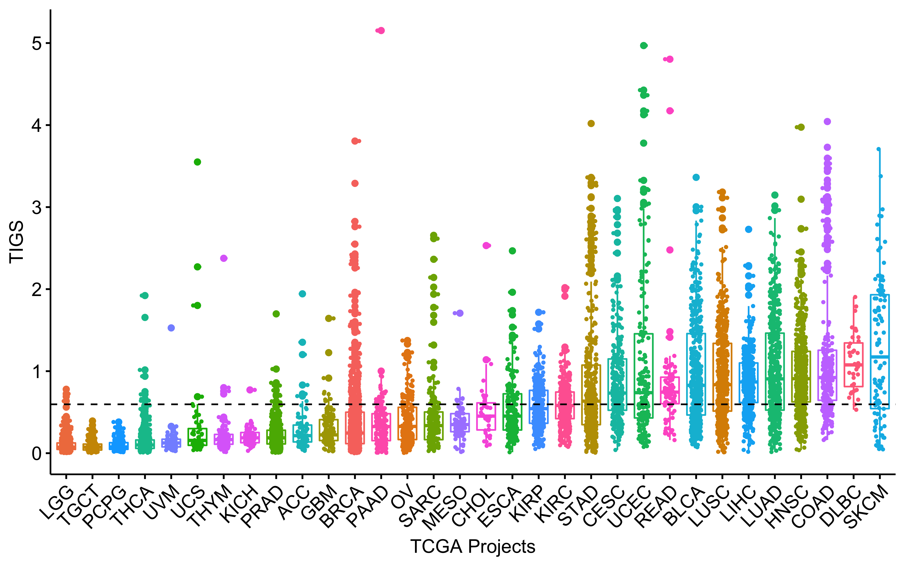
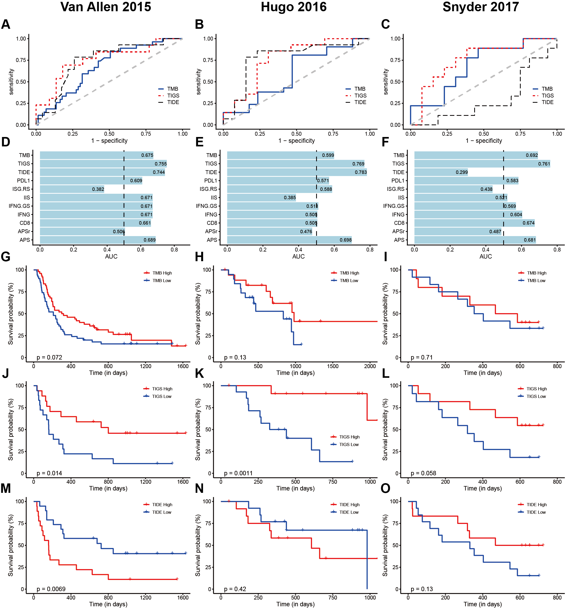

```{r, include=FALSE}
knitr::opts_chunk$set(echo = FALSE,
                      warning = FALSE,
                      tidy = FALSE,
                      message = FALSE,
                      fig.align = 'center',
                      out.width = "100%")
options(knitr.table.format = "html") 
```

# Abstract

Immunotherapy, represented by immune checkpoint inhibitors (ICI), is transforming the treatment of cancer. However, only a small percentage of patients show response to ICI, and there is an unmet need for biomarkers that will identify patients more likely to respond to ICI. The fundamental basis for ICI response is the immunogenicity of tumor, which is primarily determined by tumor antigenicity and antigen presentation efficiency. Here we propose a method to measure tumor immunogenicity score (TIGS), which combines tumor mutational burden (TMB) and antigen processing and presenting machinery (APM) gene expression signature. In both pan-cancer ICI objective response rates correlation and ICI clinical response prediction for individual patients, TIGS showed consistently improved performance compared to TMB and other known ICI response prediction biomarkers. This study suggests that the tumor immunogenicity score is an effective tumor inherent biomarker for ICI response prediction.

# Results

```{r, figure1, fig.cap='Tumor immunogenicity score (TIGS) analysis in 32 cancer types.', out.width="80%"}

```

```{r, figure2, fig.cap='Cox proportional hazards regression analysis and meta-analysis using TIGS for all solid cancers.', out.width="80%"}

```

```{r, figure4, fig.cap='TIGS and predicted pan-cancer response rates to PD-1 inhibition. Correlation between APS TIGS and objective response rate with anti-PD-1 or anti-PD-L1 therapy in 25 cancer types. Shown are TIGS in 25 tumor types or subtypes among patients who received inhibitors of PD-1 or PD-L1, as described in published studies for which data regarding the objective response rate are available. The number of patients who were evaluated for the objective response rate is shown for each tumor type (size of the circle).', out.width="100%"}

```

```{r, figure5, fig.cap='TIGS predicts ICI immunotherapy clinical response, evaluated in (A) Van Allen 2015 dataset (B) Hugo 2016 dataset and (C) Snyder 2017 dataset.', out.width="100%"}

```

# Conclusion

- TIGS exhibits improved pan-cancer ICI objective response rate correlation, and ICI clinical response prediction accuracy compared with TMB.
- TIGS represents a novel and effective tumor inherent biomarker for immunotherapy response prediction.

# More

You can scan QR code at bottom center to see online analysis report. All code and related data are published at <https://github.com/XSLiuLab/tumor-immunogenicity-score>.

# Acknowledgement

We thank the authors and participating patients of immunotherapy publications for providing the data for this analysis. Our gratitude is also extended to the TCGA project for making cancer genomics data available for analysis. We thank Raymond Shuter for editing the text. Thank ShanghaiTech University High Performance Computing Public Service Platform for computing services. Thanks also to other members of Liu lab for helpful discussion. 

# Recent works of our lab

- Wang, Shixiang, et al. "Antigen presentation and tumor immunogenicity in cancer immunotherapy response prediction." **eLife** (accepted) (2019).
- Wang, Shixiang, Li An Cowley, and Xue-Song Liu. "Sex Differences in Cancer Immunotherapy Efficacy, Biomarkers, and Therapeutic Strategy." **Molecules** 24.18 (2019): 3214.
- He, Zaoke, et al. "Ras Downstream Effector GGCT Alleviates Oncogenic Stress." **iScience** 19 (2019): 256-266.
- Wang, Shixiang, and Xuesong Liu. "The UCSCXenaTools R package: a toolkit for accessing genomics data from UCSC Xena platform, from cancer multi-omics to single-cell RNA-seq." **The Journal of Open Source Software** 4 (2019).
- Wang, Shixiang, et al. "The predictive power of tumor mutational burden in lung cancer immunotherapy response is influenced by patients’ sex." **International journal of cancer** (2019).
- Wang, Shixiang, et al. "APOBEC3B and APOBEC mutational signature as potential predictive markers for immunotherapy response in non-small cell lung cancer." **Oncogene** 37.29 (2018): 3924.

***

[©Cancer Biology Group](https://github.com/XSLiuLab/) 2019

<small>Research group led by Xue-Song Liu in ShanghaiTech. University. Lab website is shown in QR code at bottom right.</small>
